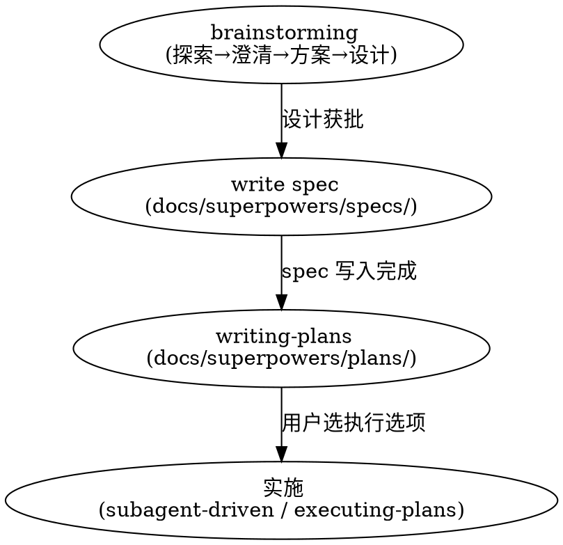

# 项目工作流规则

> 本文档记录跨所有 skill 的通用工作流约定，由 powerelf-skills 所有参与者遵守。

## 1. Spec 产出后的执行选项规则

当 writing-plans skill 完成实施计划（`docs/superpowers/plans/YYYY-MM-DD-<feature>-implementation.md`）并提交后，**必须**向用户提供两个执行选项：

```
**Plan complete and saved to `docs/superpowers/plans/<filename>.md`。Two execution options:**

**1. Subagent-Driven (recommended)** - I dispatch a fresh subagent per task, review between tasks, fast iteration

**2. Inline Execution** - Execute tasks in this session using executing-plans, batch execution with checkpoints

**Which approach?**
```

### 选项说明

| 选项 | 触发 skill | 说明 |
|------|-----------|------|
| **Subagent-Driven** | `superpowers:subagent-driven-development` | 每个 Task 独立子 agent，Task 间人工审查，快速迭代 |
| **Inline Execution** | `superpowers:executing-plans` | 在本会话批量执行，含检查点供审查 |

### 执行规则

- 用户选择前，**不自动启动任何实施**。
- 用户选择后，立即调用对应 skill，不要再次确认。
- 若用户未明确选择，应主动询问"Which approach?"。

---

## 2. Git Proxy 环境变量规则

当 `git push` 失败时，按以下顺序重试（**不写入 gitconfig**）：

```bash
# 1. 裸 push
git push origin <branch>

# 2. 失败 → 设 HTTPS_PROXY 重试
HTTPS_PROXY=socks5://192.168.200.71:7897 git push origin <branch>

# 3. 仍失败 → 升级 ALL_PROXY
ALL_PROXY=socks5://192.168.200.71:7897 git push origin <branch>
```

代理值：`192.168.200.71:7897`（SOCKS5）。

---

## 3. Spec → Plan → 实施 三阶段流程



- **brainstorming** → 产出设计 → 写 spec 到 `docs/superpowers/specs/` → 用户复核 → **writing-plans** → 产出实施计划到 `docs/superpowers/plans/` → 用户选执行选项 → 实施。
